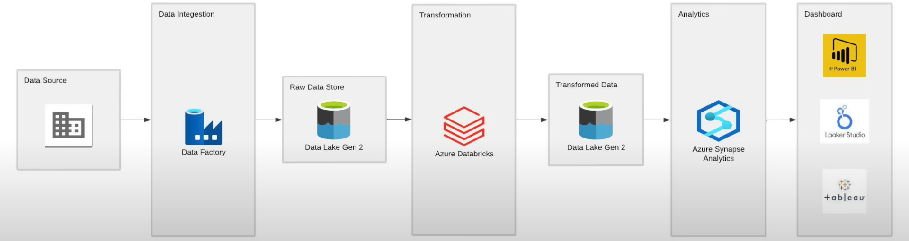

# olympic-data-analysis-azure

●	This project focuses on Olympics Data Engineering and Analytics completed in January 2024. It showcases a robust data pipeline built using Azure Cloud Computing Services. The pipeline dynamically scales to handle large data volumes and ingests data from Azure Data Factory into Data Lake Storage, organized into 8 distinct containers for efficient storage and retrieval. This setup ensures scalability, reliability, and cost-effectiveness.

●	Using Apache Spark, the project processes and transforms the data to focus on key areas like athletes, coaches, medals, and team participation. This optimized processing improved operational adequacy by over 12% and provided in-depth insights into disciplines and team performances.

●	Centralized analysis was achieved using Azure Synapse Analytics, which streamlined data visualization and empowered sports stakeholders with actionable insights. The analysis boosted decision-making efficiency by over 90%, enabling data-driven strategies in sports management, training, and planning. This project emphasizes the power of data engineering in revolutionizing sports analytics and operations at scale.
